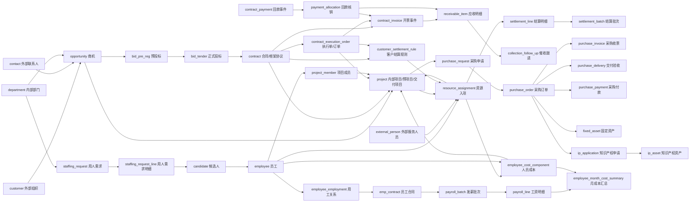
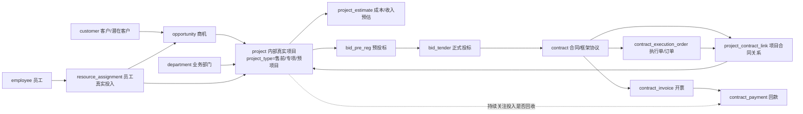
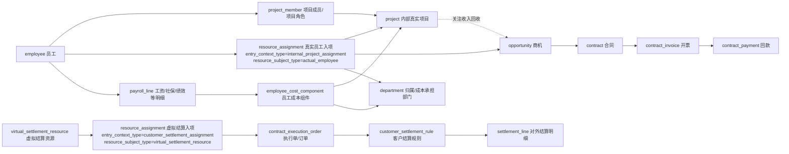

# TwinCore 企业运营管理平台全域对象关系图 V1

## 0. 文档定位

本文用于把 TwinCore 企业运营管理平台的核心对象关系画成“本体智能体可理解的地图”。

核心原则：

1. 主体、关系、规则、承诺、事件、结果分层。
2. 页面和报表只是投影，不能反向定义对象。
3. 全域主链必须能贯通收入、成本、资源、履约和资金。
4. 名称字段只做快照，运行关系优先使用 ID。

---

## 1. 全域总图

---

## 2. 主链一：客户到收入现金链

标准路径：

`customer -> opportunity -> project -> bid_pre_reg -> bid_tender -> contract -> contract_execution_order -> project_contract_link -> contract_invoice -> receivable_item -> contract_payment -> payment_allocation -> collection_follow_up`

| 起点 | 关系 | 终点 | 说明 |
|---|---|---|---|
| `customer` | 产生需求 | `opportunity` | 客户是真身，商机是需求机会 |
| `opportunity` | 提前生成/绑定 | `project` | 售前、方案、投标支撑可先形成内部真实项目 |
| `opportunity` | 进入投标判断 | `bid_pre_reg` | 投不投、谁推动、以谁投 |
| `bid_pre_reg` | 转正式投标 | `bid_tender` | 正式投标主对象 |
| `bid_tender` | 中标后形成 | `contract` | 合同是商务承诺 |
| `contract` | 分解执行边界 | `contract_execution_order` | 框架下订单/执行协议/范围 |
| `contract`/`contract_execution_order` | 回绑/升级 | `project` | 已有售前项目可升级为履约项目，也可新建交付项目 |
| `contract`/`execution_order` | 发生开票 | `contract_invoice` | 开票是事件 |
| `contract_invoice` | 形成应收 | `receivable_item` | 应收是结果对象 |
| `contract_payment` | 核销应收 | `payment_allocation` | 回款可跨多发票 |
| `receivable_item` | 触发催收 | `collection_follow_up` | 长账龄形成催收事件 |

---

## 2.1 商机到项目的前置关系

商机和项目不能等到合同签署后才发生关系。按 TwinCore 的经营口径，商机一旦进入需要投入员工、方案、调研、投标或采购支持的阶段，就应允许提前生成或绑定内部真实项目。

这个关系的核心不是“商机是否已经签合同”，而是“商机是否已经消耗公司资源”。一旦消耗员工、采购、投标、方案等资源，就需要项目对象来承接成本、任务和责任部门。

关键结论：

1. `opportunity -> project` 是前置关系，不能只在合同后补录。
2. `project` 可以先是售前/专项/预项目，后续通过 `project_contract_link` 绑定合同或执行单。
3. 商机丢单时，项目仍然是真实发生的内部项目，成本归入部门或经营归属对象。
4. 商机转合同后，项目不一定重建，应优先将原内部项目升级/回绑到合同、执行单和回款链。
5. 本体智能体分析项目收益时，必须从项目反查商机、员工投入、成本、合同、开票和回款。

---

## 3. 主链二：框架协议到资源结算链

标准路径：

`customer -> framework contract -> contract_execution_order -> customer_settlement_rule -> resource_assignment -> settlement_batch -> settlement_line`

| 起点 | 关系 | 终点 | 说明 |
|---|---|---|---|
| `customer` | 签署 | `contract` | 框架协议仍是合同 |
| `contract` | 派生 | `contract_execution_order` | 执行单记录时间、范围、结算边界 |
| `contract_execution_order` | 使用/覆盖 | `customer_settlement_rule` | 岗位、级别、单价、周期 |
| `customer_settlement_rule` | 约束 | `resource_assignment` | 入项单价不能随意手填 |
| `employee`/`external_person`/`virtual_settlement_resource` | 进入 | `resource_assignment` | 资源入项可能是真实人员，也可能是虚拟结算资源 |
| `resource_assignment` | 生成依据 | `settlement_line` | 结算明细必须可追溯 |
| `settlement_line` | 汇总 | `settlement_batch` | 周期批次 |

---

## 3.1 资源入项的两个维度

`resource_assignment` 不能简单拆成“真实项目入项”和“经营资源入项”。按当前业务口径，应拆成两个正交维度理解。

第一维：入项所在业务上下文。

| 上下文类型 | 含义 | 典型关联 | 关注重点 |
|---|---|---|---|
| `internal_project_assignment` | 内部真实项目入项 | `project` `opportunity` `department` | 真实投入、成本归集、商机能否转合同和回款 |
| `customer_settlement_assignment` | 客户/合同结算入项 | `customer` `contract` `contract_execution_order` `customer_settlement_rule` | 结算依据、结算金额、对外收入 |

第二维：入项资源主体。

| 资源主体类型 | 含义 | 典型对象 | 关注重点 |
|---|---|---|---|
| `actual_employee` | 真实内部员工投入 | `employee` | 工时、任务、成本、部门投入 |
| `actual_external_person` | 真实外部服务人员投入 | `external_person` | 外包人员、供应商、劳务结算 |
| `virtual_settlement_resource` | 虚拟结算资源 | `virtual_settlement_resource` 或结算资源快照 | 对外结算口径，不必等同真实人员投入 |

因此，一个员工提前参与电科院专项方案、售前调研、投标支撑时，可以是内部真实项目入项：

`employee -> resource_assignment(internal_project_assignment, actual_employee) -> project -> opportunity -> department -> employee_cost_component -> employee_cost_allocation`

这个场景关注的是：

1. 员工是否真实投入了内部项目。
2. 成本是否归集到对应业务部门。
3. 这个内部项目关联的商机是否转合同。
4. 后续是否有开票和回款覆盖前期投入。

另一个场景是客户、合同、结算规则都存在，但投入人员并不是真实投入人员，而是虚拟结算资源：

`virtual_settlement_resource -> resource_assignment(customer_settlement_assignment, virtual_settlement_resource) -> contract_execution_order -> customer_settlement_rule -> settlement_line`

这个场景关注的是：

1. 是否有真实客户、合同、执行单和结算规则。
2. 虚拟结算资源是否只是对外结算口径。
3. 结算收入与内部真实投入成本如何匹配、归集和分析。

关键结论：

1. 内部真实项目入项不一定有合同、执行单或结算规则，但必须有关联项目、商机或部门归属。
2. 客户结算入项不一定代表真实人员投入，可能是虚拟结算资源。
3. 系统必须同时保留“真实投入成本链”和“对外结算收入链”，不能用一条入项口径互相覆盖。

---

## 4. 主链三：招聘到人力资源链

标准路径：

`department/project/customer -> staffing_request -> staffing_request_line -> candidate -> candidate_interview -> employee/external_person -> employee_employment/resource_assignment`

| 起点 | 关系 | 终点 | 说明 |
|---|---|---|---|
| `department` | 提出 | `staffing_request` | 事业部是内部部门，也是需求来源 |
| `project`/`customer` | 触发 | `staffing_request` | 项目/客户专项必须绑定 |
| `staffing_request` | 拆分岗位 | `staffing_request_line` | 每个岗位、人数、性质一条明细 |
| `staffing_request_line` | 产生候选 | `candidate` | 招聘过程对象 |
| `candidate` | 面试评审 | `candidate_interview` | 面试是事件 |
| `candidate` | 转化 | `employee`/`external_person` | 自用进入员工链，劳务可进入外部服务人员链 |
| `employee` | 建立用工 | `employee_employment` | 管理、签约、用工类型 |
| `employee`/`external_person` | 进入项目 | `resource_assignment` | 形成经营资源 |

---

## 5. 主链四：用工薪酬到月成本链

标准路径：

`employment_type_definition -> employment_type_payroll_rule -> payroll_item_definition -> salary_structure_template -> labor_contract_version_template -> emp_contract -> payroll_batch -> payroll_line -> employee_month_cost_summary`

| 起点 | 关系 | 终点 | 说明 |
|---|---|---|---|
| `employment_type_definition` | 匹配 | `employment_type_payroll_rule` | 用工类型不是枚举 |
| `payroll_item_definition` | 被选用 | `salary_structure_component` | 薪资项目库是项目真身 |
| `salary_structure_template` | 包含 | `salary_structure_component` | 薪资方案版本 |
| `labor_contract_version_template` | 选择 | `salary_structure_template` | 合同模板不直接定义工资项目 |
| `emp_contract` | 固化 | `salary_structure_snapshot` | 员工合同必须保存快照 |
| `payroll_batch` | 生成 | `payroll_line` | 发薪结果 |
| `payroll_line` | 形成 | `payslip_line` | 工资条投影 |
| `payroll_line`/社保/公积金/个税 | 汇总 | `employee_month_cost_summary` | 月成本汇总 |

---

## 5.1 员工到项目的核心关系

项目最大的投入来源通常是员工。系统里员工与项目不能只通过一个“项目成员名单”表达，至少要分三层：

| 关系层 | 对象 | 说明 | 解决的问题 |
|---|---|---|---|
| 项目角色关系 | `project_member` | 员工在项目中承担什么角色 | 谁参与项目、谁负责交付 |
| 真实投入关系 | `resource_assignment` | 员工在什么时间、以什么岗位进入项目或商机相关内部项目 | 员工真实投入了哪个项目 |
| 成本发生关系 | `employee_cost_component` | 员工工资、社保、绩效、外包等成本如何归到项目 | 项目成本从哪里来 |

标准追溯路径：

`employee -> project_member -> project`

`employee -> resource_assignment(internal_project_assignment, actual_employee) -> project/opportunity/department`

`employee -> payroll_line/social_insurance_line/housing_fund_line -> employee_cost_component -> project -> employee_cost_allocation`

业务含义：

1. `project_member` 解决“员工是不是这个项目的人、负责什么角色”。
2. `resource_assignment` 解决“员工是否真实投入、投入周期、投入上下文、是否可转收入回收”。
3. `employee_cost_component` 解决“员工成本是否归集到项目、部门、商机或共通对象”。
4. 对项目经营分析而言，员工是项目成本和交付能力的核心来源，必须能从项目反查员工，也能从员工反查项目。

---

## 6. 主链五：采购到成本/资产/IP 链

标准路径：

`department/project/contract -> purchase_request -> purchase_order -> purchase_invoice -> purchase_delivery -> purchase_payment -> project_cost/fixed_asset/ip_application`

| 起点 | 关系 | 终点 | 说明 |
|---|---|---|---|
| `department`/`project` | 发起 | `purchase_request` | 钉钉采购申请应并入 |
| `purchase_request` | 形成 | `purchase_order` | 对供应商形成承诺 |
| `purchase_order` | 对应供应商 | `supplier_role_profile`/`customer` | 供应商是外部组织角色 |
| `purchase_order` | 产生收票 | `purchase_invoice` | 收票事件 |
| `purchase_order` | 产生交付 | `purchase_delivery` | 到货、服务、验收、成果 |
| `purchase_order` | 产生付款 | `purchase_payment` | 付款事件 |
| `purchase_order` | 形成资产 | `fixed_asset` | 设备/硬件采购 |
| `purchase_order` | 支撑 | `ip_application` | 专利、论文、软著 |
| `purchase_order` | 归集成本 | `purchase_cost_allocation` | 项目、共通、部门、IP、资产 |

---

## 7. 主链六：知识产权申请到资产链

标准路径：

`project/purchase_order/department -> ip_application -> ip_app_progress -> ip_asset -> ip_classification / ip_author`

| 起点 | 关系 | 终点 | 说明 |
|---|---|---|---|
| `department` | 提出 | `ip_application` | 申请部门 |
| `project` | 支撑 | `ip_application` | 项目型 IP 必须关联 |
| `purchase_order` | 支撑 | `ip_application` | 外采专利/论文/软著 |
| `ip_application` | 追加进度 | `ip_app_progress` | 受理、补正、授权、驳回 |
| `ip_application` | 转化 | `ip_asset` | 申请和资产分离 |
| `ip_asset` | 关联作者 | `ip_author` | 发明人/作者 |
| `ip_asset` | 挂分类 | `ip_asset_classification` | 分类方案和分类项 |

---

## 8. 横向治理关系

| 治理对象 | 关联对象 | 作用 |
|---|---|---|
| `approval_flow` / `approval_event` | 招聘、采购、合同、付款、变更 | 统一审批流，钉钉审批并入 |
| `document_evidence` | 合同、发票、付款、验收、IP、资产 | 高风险事实证据 |
| `risk_event` | 应收、采购、供应商、合同、项目 | 风险记录和闭环 |
| `reminder_task` | 催收、待确认池、证照到期、合同到期 | 任务提醒 |
| `data_quality_issue` | 导入数据、历史 Excel、异常核销 | 数据治理 |
| `contract_code_rule` | 合同、框架、执行单、采购合同 | 自动编号规则 |
| `collection_escalation_rule` | 应收、催收 | 90 天、半年、一年等升级 |

---

## 9. 智能体优先导航路径

当智能体回答问题时，优先从下列入口判断：

| 用户问题类型 | 优先入口 | 追溯路径 |
|---|---|---|
| 客户还有多少未回款 | `customer` | 客户 -> 合同 -> 开票 -> 应收 -> 回款核销 -> 催收 |
| 某项目为什么亏损 | `project` | 项目 -> 合同/执行单 -> 资源入项 -> 成本 -> 采购 -> 结算/回款 |
| 某采购为什么付款 | `purchase_order` | 采购申请 -> 订单 -> 收票 -> 交付验收 -> 付款 -> 成本归属 |
| 某员工工资为什么这样算 | `employee` | 用工关系 -> 员工合同 -> 薪资规则 -> 发薪批次 -> 工资明细 |
| 某资源为什么按这个单价结算 | `resource_assignment` | 客户 -> 框架 -> 执行单 -> 结算规则 -> 资源入项 -> 结算明细 |
| 某招聘需求是否合理 | `staffing_request_line` | 需求来源 -> 需求原因 -> 岗位映射 -> 招聘性质 -> 审批 -> 项目/客户 |
| 某知识产权是否完整 | `ip_application`/`ip_asset` | 申请 -> 项目/采购 -> 作者 -> 进度 -> 资产 -> 证据 |
